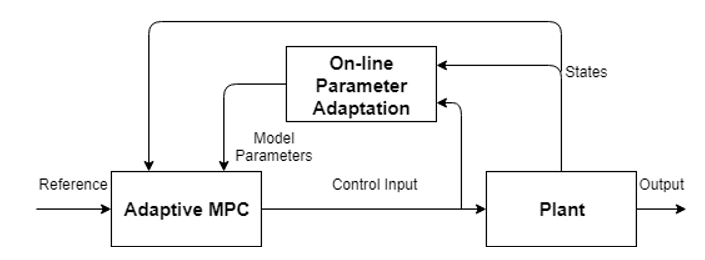
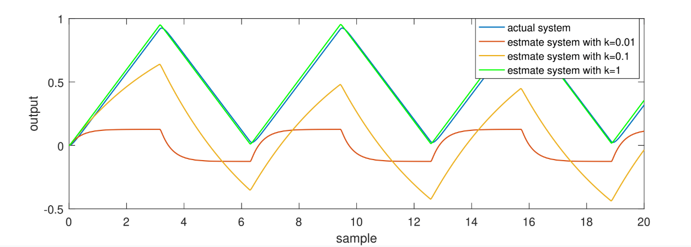
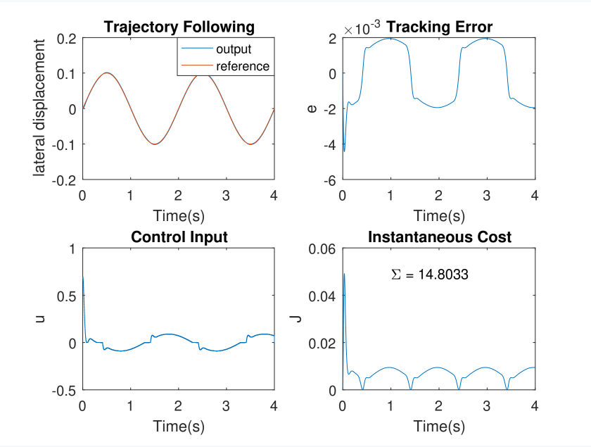
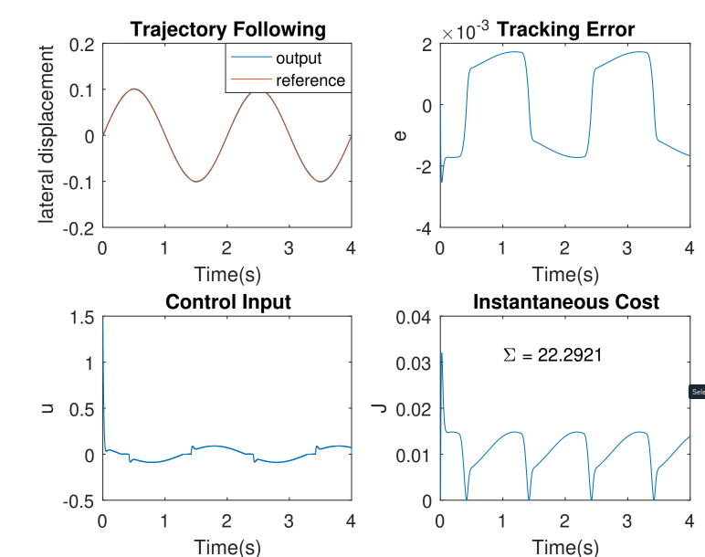

# Adaptive Model Predictive Control on Linear Motor

## Report
Please see Adaptive Model Predictive Control.pdf

## Performance:

The structure of the adaptive model predictive control

The recursive least square estimater perform a online identification of plant, in case there is some changes on the plant

The model predictive control(MPC)

